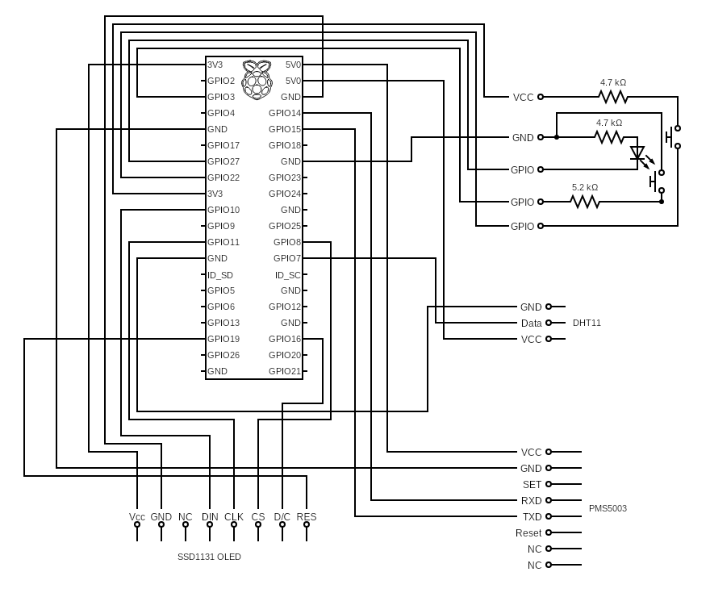

# AirQMS 

Air quality monitor based on RaspberryPi, PMS5003 sensor and DHT11 temperature and humidity sensor.
In order to display the measurements it uses a 0.96" color OLED display (SSD1331 - SPI) through ssd1331 library from Waveshare.
For user interaction I've added two buttons, one that allows to shutdown PWM the raspian application safely and the other SEL allowing to interact with the application and change the page displayed and therefore the data displayed.

## Building and Dependencies
The application runs on Raspbian and uses WiringPI to access the pins http://wiringpi.com/ which comes pre-installed in Raspian systems (http://wiringpi.com/download-and-install/)
The Makefile expects gcc to be installed and most of the dependencies are copied inside the github repository (Waveshare library for SSD1331 as well with included copyrights)
On Raspberry PI the application can be started manually or through a script airQMS_initd.script that could potentially be setup to start at bootup 
## Wiring

